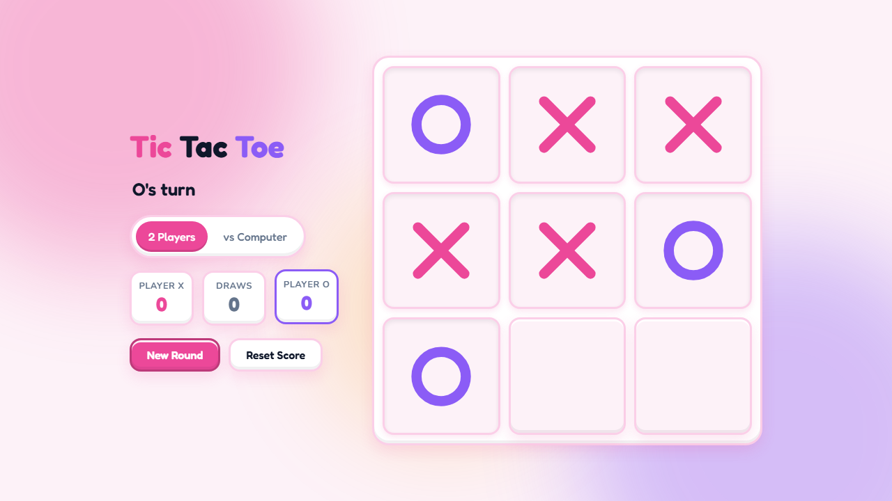
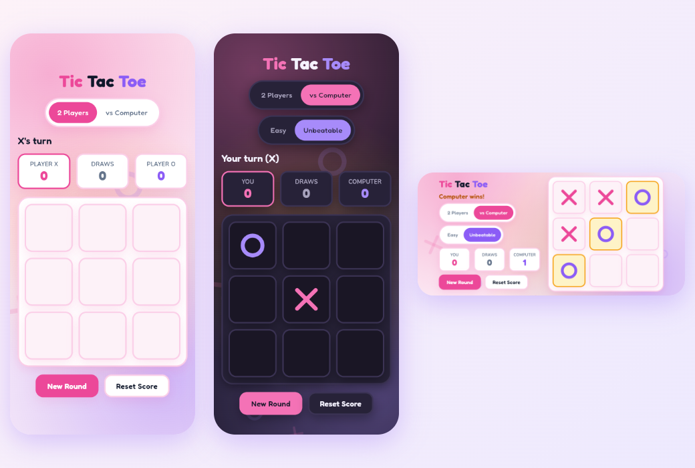

# Tic Tac Toe with Unbeatable AI (Web + Flutter Android App)

A free **Tic Tac Toe game** you can play in the browser or on your phone. Play against a friend on the same device, or challenge an **unbeatable AI powered by the minimax algorithm**. The web version is plain HTML, CSS and JavaScript with no build step and deploys to Vercel in one click. The **Flutter app** gives you the same game as an installable Android APK.

**[🎮 Play online now](https://tic-tac-toe-unbeatable-ai-one.vercel.app/)** · **[⬇️ Download the Android app (APK)](https://github.com/kapoordeepanshu/tic-tac-toe-unbeatable-ai/releases/latest)**

[](https://tic-tac-toe-unbeatable-ai-one.vercel.app/)

---

## Why this game exists

Tic Tac Toe is the "Hello, World!" of game AI. It's small enough to understand completely, yet it teaches the core ideas behind every game-playing program: game state, turns, win detection and searching for the best move.

This project was built to:

- **Learn and demonstrate the minimax algorithm** in fewer than 30 lines of readable JavaScript
- **Show that vanilla JS is enough**: no React, no bundler, just three files
- **Practice modern UI design**: a soft, playful *claymorphism* look with dark mode and animations
- **Make something people actually play** instead of another to-do app

## The (slightly embarrassing) story behind it

It started at a family dinner. My 12-year-old nephew challenged me to Tic Tac Toe on a paper napkin.

I lost. Then I lost again. By game seven he was playing with his *eyes closed* and still winning.

As a software developer, I did the only reasonable thing: I went home and wrote a program that **cannot lose**. Minimax, full game-tree search, mathematically perfect play. Next visit, I handed him my tablet with a smug grin.

He played it to a draw. Every. Single. Time. Then he looked up and said, *"Can we play on the napkin again? You're easier."*

So the AI got an **Easy** mode, for my ego and for anyone who, like me, wants to win once in a while. 🙃

---

## Features

- 🎮 **Two game modes**: *2 Players* on one device, or *vs Computer*
- 🤖 **Unbeatable AI** using minimax with depth scoring, so it wins fast and loses slowly (it never loses)
- 😌 **Easy mode** for casual play (mostly random moves, occasionally smart)
- 🏆 **Persistent scoreboard** saved in `localStorage`
- 🔁 **Fair play**: the starting player alternates every round
- ✨ **Animated UI**: X and O draw themselves, the winning line bounces, and the background drifts with floating X/O shapes
- 🖱️ **Custom X / O mouse cursor** that shows whose turn it is
- 🌗 **Light and dark mode**, following your system theme
- 📱 **Fully responsive**: side-by-side layout on desktop, stacked on mobile, no scrolling
- ♿ **Accessible**: keyboard playable, screen-reader labels, visible focus, respects *reduced motion*

## Live demo

👉 **[tic-tac-toe-unbeatable-ai-one.vercel.app](https://tic-tac-toe-unbeatable-ai-one.vercel.app/)**

It's free, with no sign-up and no download, and works on desktop, tablet and phone. Want your own copy? See [Deploy to Vercel](#deploy-to-vercel).

## Flutter mobile app

I've added the **Flutter code** as well, so anyone can play on their phone, no browser needed. The [`flutter_app/`](flutter_app) folder has a native app with the same unbeatable AI, claymorphism design and animations as the web version. The design works on every screen size: small and large phones, landscape and tablets, in light and dark mode.



- **Android:** download `tic-tac-toe.apk` from the [latest release](https://github.com/kapoordeepanshu/tic-tac-toe-unbeatable-ai/releases/latest) and install it on your phone.
- **Build it yourself:** see [`flutter_app/README.md`](flutter_app/README.md).
- A GitHub Actions workflow tests the app (including a check that the AI **never loses** across every possible game) and builds a new APK for each release.

## How the unbeatable AI works

The computer uses the **minimax algorithm**, which plays out every possible future game:

1. For each empty cell, pretend to play there.
2. Recursively let each player make their best reply until the game ends.
3. Score the outcome: **win = +10, loss = −10, draw = 0**, adjusted by depth so faster wins score higher.
4. Pick the move with the best guaranteed score.

A 3×3 board has at most 9! (362,880) move sequences, so a full search takes only milliseconds. With perfect play from both sides, Tic Tac Toe always ends in a **draw**, which is why you can't beat it.

See `minimax()` in [`script.js`](script.js).

## Tech stack

| Layer   | Choice |
|---------|--------|
| Markup  | Semantic HTML5 |
| Styling | CSS3 (custom properties, grid, `color-mix`, keyframe animations) |
| Logic   | Vanilla JavaScript (ES2020, no dependencies) |
| Fonts   | [Fredoka](https://fonts.google.com/specimen/Fredoka) + [Nunito](https://fonts.google.com/specimen/Nunito) |
| Hosting | [Vercel](https://vercel.com) (static), live at [tic-tac-toe-unbeatable-ai-one.vercel.app](https://tic-tac-toe-unbeatable-ai-one.vercel.app/) |
| SEO     | Meta + Open Graph + Twitter cards, JSON-LD structured data, sitemap |
| Mobile  | [Flutter](https://flutter.dev) (Dart), APK built with GitHub Actions |

## Getting started

```bash
git clone https://github.com/kapoordeepanshu/tic-tac-toe-unbeatable-ai.git
cd tic-tac-toe-unbeatable-ai
```

Open `index.html` in any browser, or serve it locally:

```bash
npx serve .
```

## Deploy to Vercel

**Option A: dashboard**
1. Go to [vercel.com/new](https://vercel.com/new) and import this repository.
2. Set Framework Preset to **Other**, leave the build command empty, and set the output directory to `./`.
3. Click **Deploy**.

**Option B: CLI**
```bash
npm i -g vercel
vercel --prod
```

## Project structure

```
├── index.html        # Page markup
├── style.css         # Claymorphism theme, layout, animations
├── script.js         # Game logic + minimax AI
├── favicon.svg       # X/O icon
├── apple-touch-icon.png, site.webmanifest   # Home-screen icon & app manifest
├── og-image.png      # Social share preview (1200×630)
├── robots.txt, sitemap.xml                  # Search engine crawling
├── docs/
│   ├── screenshot.png
│   └── flutter-app.png
├── flutter_app/      # Flutter mobile app (Android)
│   ├── lib/          # Game screen, minimax AI, painters, theme
│   └── test/         # AI tests: plays every possible game
└── .github/workflows/flutter-android.yml   # Builds & releases the APK
```

## Contributing

Ideas and pull requests are welcome! Some fun ones:

- Online multiplayer
- Sound effects
- A 4×4 or "ultimate" Tic Tac Toe mode
- Alpha-beta pruning for bigger boards

---

⭐ If this made you smile (or helped you finally beat a 12-year-old), please **star the repo**. It helps others find it!
